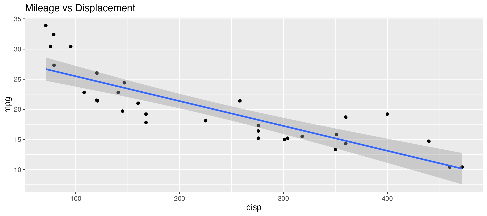
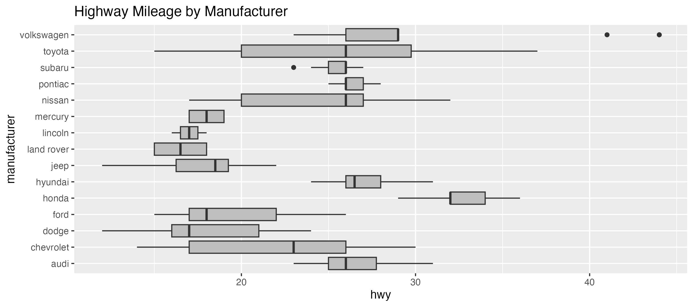

# Math 265: Homework 1
Your Name
2025-01-11

- [Overview](#overview)
- [Make the Plot You See](#make-the-plot-you-see)
- [Create Plots to Explore the Diamonds
  Data](#create-plots-to-explore-the-diamonds-data)

# Overview

This assignment asks you to get practice with `ggplot2` using data sets
built into the `ggplot2` package. Because the YAML heder contains the
option `echo: true`, whenever you render your Quarto document, it will
contain your R commands, the R output and your narrative text. Submit by
pushing to your GitHub repository. You are required to have at least 3
commits. I recommend that the first be after you have replaced “Your
Name” with your actual name in the YAML header above.

# Make the Plot You See

In questions 1-6 below, use the specified data set to create the plot
shown. Be sure to double-check the data set name for each problem.

1)  Use **mtcars** to reproduce this figure.

**Answer:**

2)  Use **mpg** to reproduce this figure.

**Answer:**

3)  Use **airquality** to reproduce this figure.

**Answer:**

4)  Use **mpg** to reproduce this figure.

**Answer:**

5)  Use **airquality** to reproduce this figure.

**Answer:**

6)  Use **mpg** to reproduce this figure.

**Answer:**

# Create Plots to Explore the Diamonds Data

In questions 7-10 below, use the **diamonds** data from **ggplot2** to
create the type of plot specified.[^1]

7)  Create a plot of counts for a discrete variable in the **diamonds**
    data set.

**Answer:**

8)  Create a histogram or density plot of a continuous variable in the
    **diamonds** data set.

**Answer:**

9)  Using the **diamonds** data, create a scatterplot of two numerical
    variables with an aesthetic mapped to the values a third variable
    categorical which is categorical. Your scatterplot should also have
    a single smoothing line overlaid.

**Answer:**

10) Using the **diamonds** data, create overlaid density plots with
    alpha transparency like the one shown
    [here](https://r4ds.hadley.nz/data-visualize_files/figure-html/unnamed-chunk-32-1.png)
    for the **penguins** data.

**Answer:**

[^1]: Use `?diamonds` to read about the data set.
